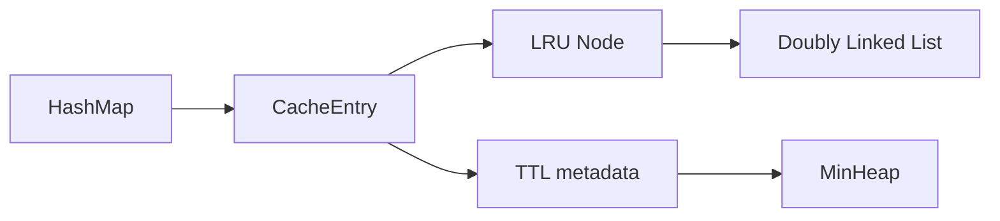
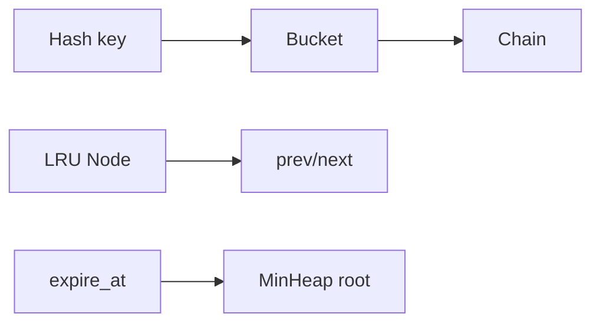
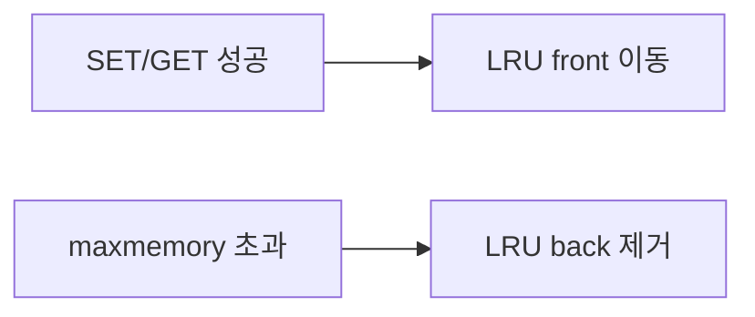
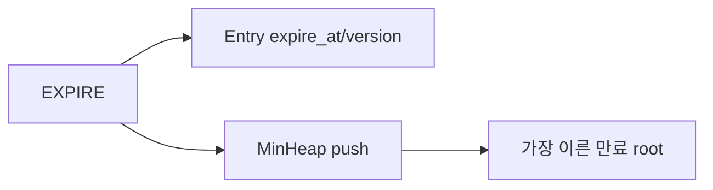

# B3-1 Round 01 — Beginner Guide

이 문서는 공식 Mission/Evaluation을 기준으로 **자료구조를 직접 구현한 Mini Redis**를 처음부터 이해하고 검증하기 위한 가이드입니다.

> 현재는 **Phase A — REFERENCE BUILD**입니다. 실제 REPL 실행·테스트·Evidence는 Phase C에서 확인합니다. Reference 코드가 존재한다는 이유만으로 CLEAR하지 않습니다.

## 00. 미션 한눈에 보기

핵심 자료구조:

- Doubly Linked List
- Chaining HashMap
- MinHeap

핵심 명령:

- `SET`, `GET`, `DEL`, `EXISTS`, `DBSIZE`, `KEYS`
- `CONFIG SET maxmemory`, `INFO memory`
- `EXPIRE`, `TTL`



HashMap은 key를 빠르게 찾고, Linked List는 최근 사용 순서를, MinHeap은 가장 빠른 만료 시각을 관리합니다.

---

# STEP 01 — 자료구조 3종 이해와 검증

## ① 왜 하는가

공식 미션은 Python `dict`, `set`, `collections`로 핵심 저장소를 대체하지 않고 내부 자료구조를 직접 구현하도록 요구합니다.

## ② 무엇을 하는가

이중 연결 리스트, 체이닝 해시맵, 최소 힙의 코드와 unit test를 확인합니다.

## ③ 이번 단계에서 알아야 할 용어

- **이중 연결 리스트 (Doubly Linked List)** — 각 node가 이전/다음 node를 가리키는 구조입니다.
- **해시맵 (Hash Map)** — key의 hash를 bucket index로 바꿔 평균 O(1) 조회를 목표로 하는 구조입니다.
- **체이닝 (Chaining)** — 같은 bucket에 충돌한 key들을 연결해 저장하는 방식입니다.
- **최소 힙 (Min Heap)** — 가장 작은 값이 root에 오도록 유지하는 완전 이진 트리형 배열 구조입니다.

## ④ 필요한 핵심 개념



각 자료구조는 서로 다른 문제를 해결합니다.

## ⑤ 실행할 명령어 또는 코드

```bash
export PYTHONPATH="$PWD/training/round-01-clear/reference"
python3 -m unittest discover \
  -s training/round-01-clear/reference/tests \
  -p 'test_*.py' -v
```

코드 위치:

```bash
sed -n '1,240p' training/round-01-clear/reference/mini_redis/doubly_linked_list.py
sed -n '1,260p' training/round-01-clear/reference/mini_redis/hash_map.py
sed -n '1,260p' training/round-01-clear/reference/mini_redis/min_heap.py
```

## ⑥ 명령어와 코드에 입문자가 이해할 수 있는 주석

unit test는 insert/remove/move, hash resize, heap ordering을 작은 입력으로 자동 확인합니다.

## ⑦ 예상되는 정상 결과

자료구조 unit test가 PASS하고 HashMap capacity가 load factor 0.75 초과 시 늘어납니다.

## ⑧ 그 결과가 의미하는 것

Mini Redis의 동작을 내장 key-value collection이 아니라 직접 만든 구조 위에서 구현할 기반이 준비되었습니다.

## ⑨ 자주 발생하는 오류와 해결 방법

- import 오류 → `PYTHONPATH` 확인
- Python 3.8 미만 → 3.8+ 환경 사용
- `dict/set/collections` 사용 탐지 → 핵심 구현을 custom HashMap/list 기반 구조로 수정

## ⑩ 완료 확인

- [ ] DLL 6개 핵심 메서드
- [ ] HashMap 6개 핵심 메서드
- [ ] custom hash + chaining
- [ ] load factor resize
- [ ] MinHeap 4개 메서드 + heapify

---

# STEP 02 — String 기본 명령 6개와 REPL

## ① 왜 하는가

SET/GET/DEL/EXISTS/DBSIZE/KEYS가 실제 저장소의 기본 동작입니다.

## ② 무엇을 하는가

REPL을 실행해 기본 명령과 Redis-style 출력을 확인합니다.

## ③ 이번 단계에서 알아야 할 용어

- **REPL** — Read-Eval-Print Loop, 명령을 반복 입력하고 즉시 결과를 보는 환경입니다.
- **Redis-style output** — `OK`, `(nil)`, `(integer) N`, `(error) ...` 형태의 출력 규칙입니다.

## ④ 필요한 핵심 개념

```text
입력 → shlex 파싱 → MiniRedis method → Redis-style 출력 → 다음 입력
```

## ⑤ 실행할 명령어 또는 코드

```bash
python3 training/round-01-clear/reference/main.py
```

REPL:

```text
SET name Alice
GET name
EXISTS name
DBSIZE
KEYS
DEL name
GET name
```

공백 값:

```text
SET greeting "hello world"
GET greeting
```

## ⑥ 명령어와 코드에 입문자가 이해할 수 있는 주석

`shlex.split()`을 사용해 큰따옴표로 묶인 값은 하나의 문자열 인자로 처리합니다.

## ⑦ 예상되는 정상 결과

SET은 `OK`, GET은 문자열 또는 `(nil)`, DEL/EXISTS/DBSIZE는 `(integer) N`, KEYS는 배열형 목록을 출력합니다.

## ⑧ 그 결과가 의미하는 것

직접 구현 HashMap에 저장된 데이터가 CLI 명령과 연결되었습니다.

## ⑨ 자주 발생하는 오류와 해결 방법

- `GET` 인자 누락 → wrong number of arguments
- 알 수 없는 명령 → unknown command
- 따옴표가 닫히지 않음 → syntax error

## ⑩ 완료 확인

- [ ] SET
- [ ] GET
- [ ] DEL
- [ ] EXISTS
- [ ] DBSIZE
- [ ] KEYS
- [ ] exit/quit

---

# STEP 03 — maxmemory, used_memory, LRU eviction

## ① 왜 하는가

Redis 같은 메모리 저장소는 제한을 넘을 때 오래 사용하지 않은 데이터를 제거해야 합니다.

## ② 무엇을 하는가

공식 UTF-8 memory 식을 확인하고 GET으로 LRU 순서를 바꾼 뒤 eviction을 재현합니다.

## ③ 이번 단계에서 알아야 할 용어

- **LRU (Least Recently Used)** — 가장 오래 사용되지 않은 데이터를 먼저 제거하는 정책입니다.
- **maxmemory** — 저장소가 사용할 수 있는 공식 계산상 최대 byte 수입니다.
- **used_memory** — 공식 식으로 계산한 현재 key/value byte 합입니다.

## ④ 필요한 핵심 개념



Entry가 LRU node를 직접 가리키므로 성공한 GET/SET에서 전체 list 탐색 없이 O(1) 이동합니다.

## ⑤ 실행할 명령어 또는 코드

```text
CONFIG SET maxmemory 6
SET a 1
SET b 22
GET a
SET c 33
GET b
GET a
GET c
INFO memory
```

UTF-8 확인 예:

```text
CONFIG SET maxmemory 0
SET 한 글
INFO memory
```

## ⑥ 명령어와 코드에 입문자가 이해할 수 있는 주석

`a+1`은 2 byte, `b+22`는 3 byte입니다. GET a 후 a가 최근 사용이 되어 b가 LRU가 되고, c 저장으로 제한을 넘으면 b가 먼저 제거되어야 합니다.

## ⑦ 예상되는 정상 결과

GET b가 `(nil)`이고 a/c는 남으며 `evicted_keys`가 증가합니다.

## ⑧ 그 결과가 의미하는 것

HashMap + DoublyLinkedList 조합으로 공식 LRU 정책이 연결되었습니다.

## ⑨ 자주 발생하는 오류와 해결 방법

- 기대한 key가 제거되지 않음 → 성공한 GET/SET 순서를 다시 확인
- used_memory가 예상과 다름 → 문자열 글자 수가 아니라 UTF-8 byte 길이 사용 여부 확인

## ⑩ 완료 확인

- [ ] CONFIG maxmemory
- [ ] INFO memory 3개 필드
- [ ] UTF-8 memory 식
- [ ] GET LRU 갱신
- [ ] eviction count

---

# STEP 04 — 단일 entry OOM과 overwrite edge case

## ① 왜 하는가

한 entry 자체가 maxmemory보다 크면 기존 데이터를 모두 지워도 저장할 수 없으므로 OOM 처리해야 합니다. overwrite 때 memory와 TTL도 정확히 갱신해야 합니다.

## ② 무엇을 하는가

single-entry OOM, overwrite memory 갱신, TTL 초기화를 확인합니다.

## ③ 이번 단계에서 알아야 할 용어

- **OOM (Out Of Memory)** — 설정된 저장 한도를 만족할 수 없어 저장을 거부하는 상태입니다.
- **Overwrite** — 기존 key에 새 value를 다시 저장하는 것입니다.

## ④ 필요한 핵심 개념

```text
entry_size > maxmemory → 기존 key eviction 없이 SET 거부
```

## ⑤ 실행할 명령어 또는 코드

```text
CONFIG SET maxmemory 3
SET a 1
SET long value
GET a
INFO memory
```

Overwrite:

```text
CONFIG SET maxmemory 0
SET k old
EXPIRE k 30
SET k new
TTL k
GET k
```

## ⑥ 명령어와 코드에 입문자가 이해할 수 있는 주석

Overwrite는 기존 entry를 새 node로 만들지 않고 같은 Entry/node를 재사용하며 old byte 비용을 빼고 new 비용을 더합니다.

## ⑦ 예상되는 정상 결과

큰 entry는 OOM, 기존 a는 유지됩니다. overwrite 이후 `TTL k`는 `-1`, GET은 `"new"`입니다.

## ⑧ 그 결과가 의미하는 것

메모리 제한과 overwrite의 edge case가 공식 요구대로 처리됩니다.

## ⑨ 자주 발생하는 오류와 해결 방법

OOM 전에 기존 key가 사라지면 single-entry 사전 검사 순서를 수정해야 합니다.

## ⑩ 완료 확인

- [ ] single-entry OOM
- [ ] 기존 데이터 보호
- [ ] overwrite memory 갱신
- [ ] overwrite TTL reset

---

# STEP 05 — EXPIRE / TTL과 MinHeap lazy deletion

## ① 왜 하는가

TTL은 시간이 지난 key를 없는 key처럼 처리해야 하며, 가장 빠른 만료 후보를 효율적으로 관리해야 합니다.

## ② 무엇을 하는가

EXPIRE, TTL, 즉시 만료, 재설정, 만료 후 key 명령을 확인합니다.

## ③ 이번 단계에서 알아야 할 용어

- **TTL (Time To Live)** — key가 만료되기까지 남은 시간입니다.
- **Lazy Deletion** — stale heap item을 즉시 찾아 제거하지 않고 root에 도달했을 때 무효 여부를 확인해 버리는 방식입니다.

## ④ 필요한 핵심 개념



EXPIRE 재설정은 과거 heap item을 남길 수 있으므로 version으로 현재 TTL과 구분합니다.

## ⑤ 실행할 명령어 또는 코드

```text
SET temp value
TTL temp
EXPIRE temp 2
TTL temp
```

실제 2초 이상 기다린 뒤:

```text
GET temp
EXISTS temp
TTL temp
DBSIZE
```

즉시 만료:

```text
SET now x
EXPIRE now 0
GET now
```

재설정:

```text
SET reset x
EXPIRE reset 5
EXPIRE reset 30
TTL reset
```

## ⑥ 명령어와 코드에 입문자가 이해할 수 있는 주석

TTL 규칙은 key 없음 `-2`, TTL 없음 `-1`, TTL 있음 `N`초입니다. 0 이하 EXPIRE는 즉시 삭제합니다.

## ⑦ 예상되는 정상 결과

만료 후 GET은 `(nil)`, EXISTS는 0, TTL은 -2가 됩니다.

## ⑧ 그 결과가 의미하는 것

MinHeap과 HashMap Entry metadata가 함께 만료 상태를 관리합니다.

## ⑨ 자주 발생하는 오류와 해결 방법

만료 key가 DBSIZE/KEYS에 남으면 전체 조회 전 expired heap purge가 되는지 확인합니다.

## ⑩ 완료 확인

- [ ] EXPIRE 존재/없는 key
- [ ] TTL -2/-1/N
- [ ] 즉시 만료
- [ ] 재설정
- [ ] 만료 key 정리

---

# STEP 06 — DEL / TTL / LRU 구조 일관성

## ① 왜 하는가

HashMap에서 key만 지우고 LRU/TTL 구조를 남기면 stale reference와 memory 계산 오류가 생깁니다.

## ② 무엇을 하는가

DEL 후 memory, LRU, TTL 상태가 함께 정리되는지 unit test와 REPL로 확인합니다.

## ③ 이번 단계에서 알아야 할 용어

- **불변식 (Invariant)** — 여러 자료구조가 항상 함께 만족해야 하는 상태 규칙입니다.

## ④ 필요한 핵심 개념

```text
DEL key
→ HashMap remove
→ LRU node remove
→ used_memory 감소
→ TTL version invalidate
```

## ⑤ 실행할 명령어 또는 코드

```text
CONFIG SET maxmemory 0
SET x abc
EXPIRE x 30
INFO memory
DEL x
TTL x
INFO memory
```

## ⑥ 명령어와 코드에 입문자가 이해할 수 있는 주석

기존 heap item 자체를 즉시 찾아 제거하지 않아도 Entry가 삭제되고 version이 무효화되면 나중에 stale item으로 버려집니다.

## ⑦ 예상되는 정상 결과

DEL은 1, TTL은 -2, used_memory는 x의 byte 비용만큼 감소합니다.

## ⑧ 그 결과가 의미하는 것

세 자료구조와 memory 통계가 같은 key lifecycle을 공유합니다.

## ⑨ 자주 발생하는 오류와 해결 방법

evicted_keys가 DEL에서 증가하면 안 됩니다. 오직 LRU eviction에서만 증가해야 합니다.

## ⑩ 완료 확인

- [ ] HashMap 삭제
- [ ] LRU node 삭제
- [ ] memory 감소
- [ ] TTL 무효화
- [ ] evicted_keys 불필요 증가 없음

---

# STEP 07 — 자동 검증과 오류 처리

## ① 왜 하는가

정상 명령뿐 아니라 자료구조/금지사항/오류 형식을 반복 검증해야 누락을 줄일 수 있습니다.

## ② 무엇을 하는가

`verify.sh`와 대표 오류 명령을 실행합니다.

## ③ 이번 단계에서 알아야 할 용어

- **정적 검사 (Static Check)** — 프로그램을 특정 시나리오로 실행하지 않고 코드 구조를 검사하는 방식입니다.
- **Smoke Test** — 핵심 경로가 최소한 동작하는지 빠르게 확인하는 테스트입니다.

## ④ 필요한 핵심 개념

Reference verify는 compile + unit test + forbidden AST + basic command smoke를 묶습니다.

## ⑤ 실행할 명령어 또는 코드

```bash
bash training/round-01-clear/environment/verify.sh
```

REPL 오류:

```text
GET
CONFIG SET maxmemory abc
HELLO
```

## ⑥ 명령어와 코드에 입문자가 이해할 수 있는 주석

AST 검사는 `dict`, `set`, `collections`를 핵심 구현에 사용했는지 확인합니다.

## ⑦ 예상되는 정상 결과

`Result: N PASS / 0 FAIL`과 Redis-style error가 확인됩니다.

## ⑧ 그 결과가 의미하는 것

자동으로 확인 가능한 구조와 핵심 command 요구가 통과했습니다.

## ⑨ 자주 발생하는 오류와 해결 방법

FAIL 한 항목만 해당 자료구조/command로 돌아가 수정합니다.

## ⑩ 완료 확인

- [ ] compile
- [ ] unit tests
- [ ] no dict/set/collections
- [ ] smoke
- [ ] error messages

---

# STEP 08 — Evidence / Evaluation / CLEAR

## ① 왜 하는가

평가는 코드뿐 아니라 왜 이 자료구조가 필요한지, 시간복잡도와 edge case를 설명할 수 있어야 합니다.

## ② 무엇을 하는가

`evidence/README.md`, `requirements-mapping.md`, `evaluation-qa.md`, CHECKLIST를 기준으로 실제 결과를 정리합니다.

## ③ 이번 단계에서 알아야 할 용어

- **시간복잡도 (Time Complexity)** — 입력 크기에 따라 연산 시간이 어떻게 증가하는지 나타내는 척도입니다.
- **Evidence** — 실제 요구 충족을 증명하는 결과입니다.

## ④ 필요한 핵심 개념

```text
Requirement → Data Structure/Code → Test/REPL → Evidence → 설명 → CLEAR
```

## ⑤ 실행할 명령어 또는 코드

```bash
sed -n '1,260p' training/round-01-clear/docs/evaluation-qa.md
bash training/round-01-clear/environment/verify.sh
```

## ⑥ 명령어와 코드에 입문자가 이해할 수 있는 주석

Evaluation 답은 외우는 문장이 아니라 실제 구현 파일과 Runtime 시나리오를 근거로 설명합니다.

## ⑦ 예상되는 정상 결과

자료구조 O(1)/O(log n), LRU, TTL heap, UTF-8 memory, edge cases를 자기 말로 설명할 수 있습니다.

## ⑧ 그 결과가 의미하는 것

Mini Redis 기능 구현과 내부 원리 이해가 함께 완료된 상태입니다.

## ⑨ 자주 발생하는 오류와 해결 방법

unit test만 통과하고 REPL Evidence가 없다면 CLEAR하지 않습니다. 실제 시나리오를 수행합니다.

## ⑩ 완료 확인

- [ ] 모든 공식 명령 실제 확인
- [ ] LRU/OOM/TTL edge Evidence
- [ ] verify 0 FAIL
- [ ] 평가 설명 가능
- [ ] **✅ B3-1 CLEAR**
